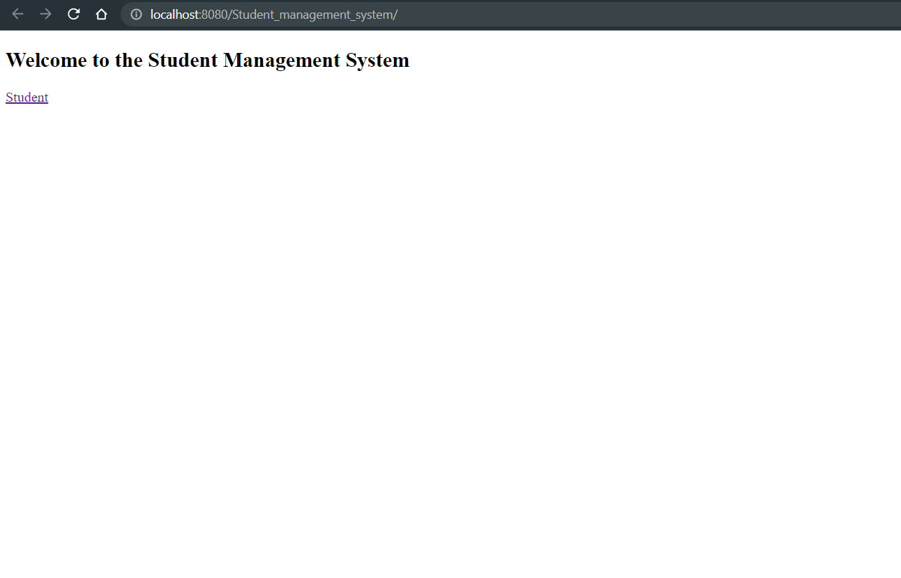
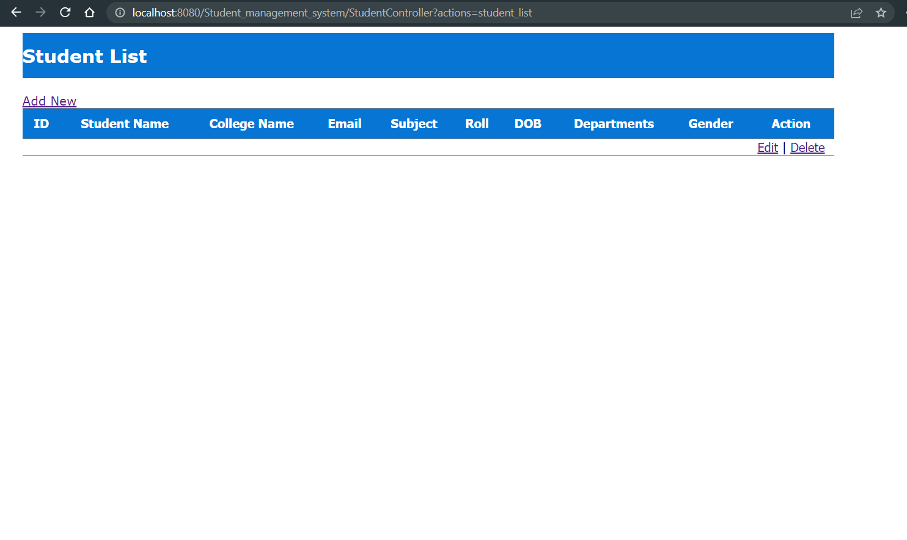
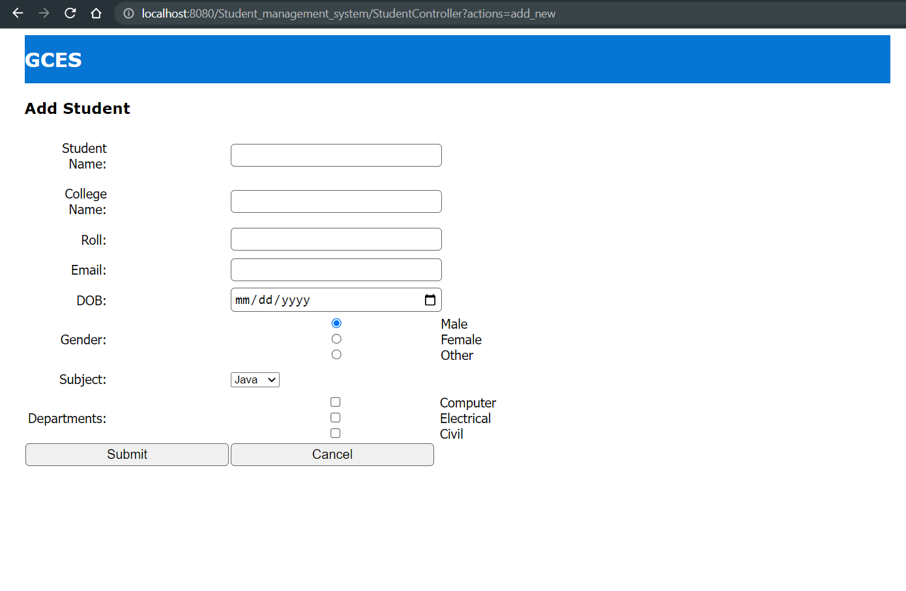

# Lab 4

## Objective

- To create a student management system using java servlet and JSP

## Theory

- `JSP, or JavaServer Pages`, is a technology for creating dynamic web pages using Java. It allows developers to embed Java code within HTML pages, which are then processed on the server and transformed into HTML pages that can be sent to the client's web browser.
- JSP provides a simplified and fast way of creating dynamic web pages, as compared to writing Servlets directly. JSP pages are composed of two main elements: static HTML, and dynamic content written in the form of JSP tags and expressions.

## Steps

- Create a `dynamic web project` inside the **Eclipse IDE**. *Note: check the generate web xml file when creating the project*
- Create a package, I have created a nested package as `com.sms`.
- Create these folders/packages `(controller, dao, dto, service, util)` inside `com.sms`.
- Create the respective `java` or `interface` file in the packages
- Run the project.

## Steps to create a server

1. Download the `Tomcat server` of apache from internet.
2. Go to the `window` menu of Eclispe IDE and select the `Show View` submenu and click on the `servers` option.
3. A window will appear at the bottom, right click on the window and create a new server.
    - For that select the apache tomcat server version you downloaded from a pop up window that will appear.
    - Give the path to the tomcat bin folder
4. Right click the newely created server and click run server. 

## Steps to add .jar files

1. Right click on the project main folder in Eclispe IDE.
2. Click on the `build path` option.
3. Click on the `Configure build path` option.
4. Click on the `libraries` tab and click the `Classpath` text.
5. Click on `Add External Jar` button and select the `jar` file from your system.
6. Click `Apply and Close`.

```
Add the mysql connector jar file

and the jstl jar file from javatpoint
```

## Output






